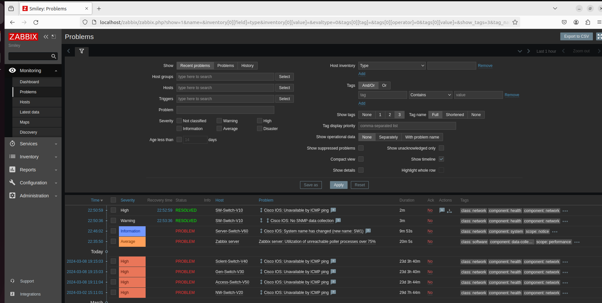
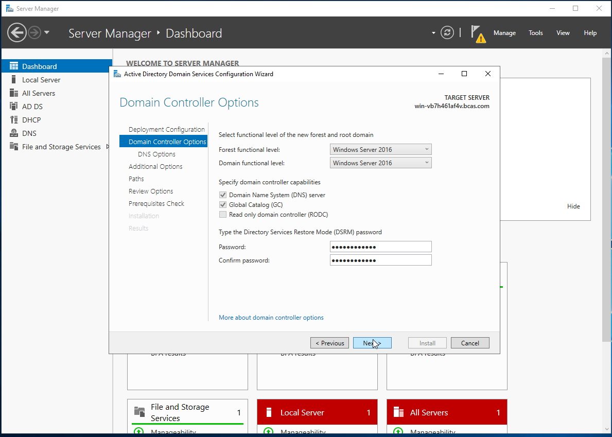
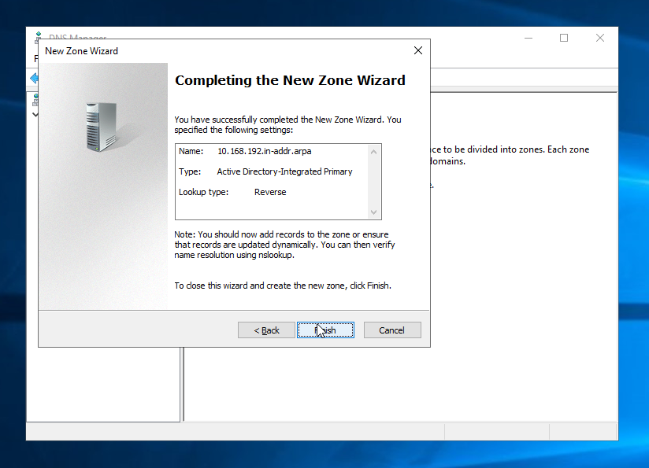

# LAN-network-for-SY-BCAS-Institute
# Table of Contents

1. [Introduction](#introduction)
2. [Network Design](#network-design)
3. [Used Hardwares](#used-hardwares)
    - [Routers](#routers)
    - [Switches](#switches)
    - [Servers](#servers)
5. [Network Device Configurations](#network-device-configurations)
    - [Router Configuration](#router-configuration)
    - [Switch Configuration](#switch-configuration)
6. [Network Monitor Tool Deployment](#network-monitoring-tool-deployment)
7. [Troubleshooting LAN and WAN Connectivity Issues](#troubleshooting-lan-and-wan-connectivity-issues)
8. [Documentation of Troubleshooting Methods](#documentation-of-troubleshooting-methods)
9. [Evaluating Troubleshooting Methods for Enterprise-Wide Networking Issues](#evaluating-troubleshooting-methods-for-enterprise-wide-networking-issues)
10. [Server Configuration](#server-configuration)
    - [Setting Up Windows Server 2019 for Active Directory, DNS and DHCP.](#setting-up-windows-server-2019-for-active-directory-dns-and-dhcp)
    - [Promoting Windows Server 2019 as Domain Controller](#promoting-windows-server-2019-as-domain-controller)
    - [Active Directory](#active-directory)
    - [DNS Server Configuration](#dns-server-configuration)
    - [DHCP Derver Configuration](#dhcp-server-configuration)

# Introduction
 <div align="justify"> Designing a Local Area Network (LAN) for the SY-BCAS Institute requires careful consideration of devices to meet the organization’s needs efficiently. The primary objective is to establish a high-performance, reliable, and secure network infrastructure capable of supporting both current and future demands. This involves selecting devices that offer robust performance, advanced security features, scalability, and manageability. By integrating a Cisco 3725 router, HP Aruba switches, and Windows Server 2019, the proposed design ensures seamless connectivity, secure communication, and efficient resource management to support the institute’s administrative and academic activities effectively.
 </div>


# Network Design

<p align="center">
  
</p>
<div align="justify">In the respective network design, there are two ISPs employeed for maintain the realiable connection between branches.</div>

## Network Segmentations
- Software Lab | VLAN - 10 | Network: 192.168.10.0/24
- Network Lab  | VLAN - 20 | Network: 192.168.20.0/24
- General Lab  | VLAN - 30 | Network: 192.168.30.0/24
- Solent Lab   | VLAN - 40 | Network: 192.168.40.0/24
- Access Lab   | VLAN - 50 | Network: 192.168.50.0/24
- Server Room  | VLAN - 60 | Network: 192.168.60.0/24

## Used Hardwares
### Routers
#### Model: Cisco 3725
- For routing purpose I have chosen Cisco 3725 model router, it stands out as the backbone of the network. Because of its advanced routing capabilities, scalability and robust security features. It has efficient data transmission while ensuring with ACL – Access control lists. Moreover with VPN feature in respective router institute can securely connect their branches. Additionally, the inclusion of redundant protocols such as HSRP – Hot Standby Router Protocol and VRRP – Virtual Router Redundancy Protocol, enhance redundancy to provide seamless failover and reliability.

### Switches
#### Model: HP Aruba Switch
- I have chosen HP Aruba switch to connect the end devices. With its efficient STP – Spanning Tree Protocol, LACP – Link Aggregation Control Protocol and VLAN segmentation enhance scalability and ensures fault tolerance by enabling redundancy and load balancing. VLAN segmentation enhance securely and resource allocation.

### Servers
#### Windows Server 2019
- I have chosen “Windows Server 2019” to host critical services like Active Directory, DHCP and DNS. It centralizes resource management, streamlines IT operations and ensures efficient administration. Robust security measures protect sensitive data. And scalability accommodates future needs and guaranteeing a robust, secure and adaptable network infrastructure.

#### Network Management System : _Zabbix_
- I have chosen Zabbix as the network monitoring solution to ensure comprehensive oversight of the infrastructure. Zabbix provides real-time monitoring of network devices, servers, and applications, allowing for proactive identification and resolution of potential issues. Its robust alerting system notifies administrators of anomalies, minimizing downtime and enhancing reliability.

## Network Device Configurations
### Router Configuration
* Assigning IP Address for respective subinterface.
```bash
  Pri-Router#configuration terminal 
  Pri-Router(config)#interface FastEthernet0/0.xx
  Pri-Router(config-subif)#encapsulation dot1Q xx
  Pri-Router(config-subif)#ip address 192.168.xx.xx 255.255.255.0
```
Interface f0/0.XX(10) is variable and encapsulation dot1Q XX(10) is same as VLAN number. After that assign IP Address with preferred subnet.

* Hot standby router protocol Configuration
```bash
  Pri-Router(config)#interface FastEthernet0/0.xx
  Pri-Router(config-subif)#standby 10 ip 192.168.10.x
  Pri-Router(config-subif)#standby 10 priority 105
  Pri-Router(config-subif)#standby 10 preempt
```
Select group number for HSRP between **0 – 255**, this number should be same on all routers which are participating in HSRP, in above scenario is “10” and it is variable.

Configure the virtual IP Address for HSRP, set up priority with group number for which router gets higher priority. The here preempt used for regain its active state if it becomes available after being In standby mode.

```bash 
  Pri-Router(config)#interface FastEthernet0/0
  Pri-Router(config-if)#standby 1 track FastEthernet0/1 95
  Pri-Router(config-if)#standby 1 preempt
```
Above statement is used to track the status of other external interface, and allows HSRP to adjust the priority of the router dynamically, based on the status of tracked interface.

* DHCP Relay Configuration
```bash 
  Pri-Router(config)#interface FastEthernet0/0.10
  Pri-Router(config-subif)#ip helper-address 192.168.60.4
```
DHCP relay helps devices like end devices in different network sections to get IP Address from a central server, here according to the requirement DHCP server is placed in Server room. Here **Window Server 2019 (IP: 192.168.60.4) Work as DHCP server**.

* SNMP Configuration for Cisco Router

Simple Network Management Protocol is important for management and monitoring of network devices. It allows to track respective device performance, optimization of network resources and identifying the issues, and this facilitate proactive troubleshooting with real-time alert for network events. And this allows centralized management of network infrastructure moreover this enhance reliability, efficiency and security of network.

```bash 
  Pri-Router(config)# snmp-server community <secret> RO/RW
```
Here <secret> is typically a password for SNMP of the router.

* Site – to – site VPN Configuration
```bash 
  Pri-Router(config)# access-list 100 permit ip 192.168.0.0 0.0.255.255 172.16.0.0 0.0.255.255
  Pri-Router(config)# crypto isakmp policy 101
  Pri-Router(config-isakmp)# authentication pre-share
  Pri-Router(config-isakmp)# encryption aes 256
  Pri-Router(config-isakmp)# group 5
  Pri-Router(config-isakmp)# lifetime 120
  Pri-Router(config-isakmp)# exit
  Pri-Router(config)# crypto ipsec transform-set headTobranch esp-aes 256 esp-sha-hmac
  Pri-Router(cfg-crypto-trans)# exit
  Pri-Router(config)# crypto map BCAS-VPN 101 ipsec-isakmp
  Pri-Router(config-crypto-map)# set peer 172.13.42.234 // IP Address of interface of edge router
  Pri-Router(config-crypto-map)# set transform-set headTobranch
  Pri-Router(config-crypto-map)# pfs group5
  Pri-Router(config-crypto-map)# match address 100
  Pri-Router(config-crypto-map)# exit
  Pri-Router(config)# interface FastEthernet0/1
  Pri-Router(config-if)# crypto map BCAS-VPN  
```
### Switch Configuration
#### Spanning Tree Protocol [STP] Configuration
* Root Swtich Configuration
```bash 
  rootSwt# configuration terminal
  rootSwt(config)# vlan 10,20,30,40,50,60
  rootSwt(config-vlan-< 10,20,30,40,50,60 >)# exit
  rootSwt(config)# spanning-tree mode rpvst
  rootSwt(config)# spanning-tree trap new-root
  rootSwt(config)# spanning-tree priority 0
  rootSwt(config)# spanning-tree vlan 1,10,20,30,40,50,60
  rootSwt(config)# spanning-tree vlan 1,10,20,30,40,50,60 priority 0
  rootSwt(config)# spanning-tree 
  rootSwt(config)# interface 1/1/x
  rootSwt(config-if)# no routing
  rootSwt(config-if)# vlan trunk allowed all
  rootSwt(config-if)# spanning-tree link-type point-to-point
  rootSwt(config-if)# spanning-tree loop-guard
  rootSwt(config-if)# loop-protect
  rootSwt(config-if)# no shutdown
```
* Designated Switch Configuration
```bash 
desgXswitch# configuration terminal
desgXswitch(config)# vlan XX
desgXswitch(config-vlan-XX)# exit
desgXswitch(config)# spanning-tree mode rpvst
desgXswitch(config)# spanning-tree vlan 1,10
desgXswitch(config)# spanning-tree
```
Configuration for switch
```bash 
 desgXswitch(config)# interface 1/1/X
 desgXswitch(config-if)# no routing
 desgXswitch(config-if)# vlan truck allowed all 
 desgXswitch(config-if)# spanning-tree link-type point-to-point
 desgXswitch(config-if)# spanning-tree loop-guard
 desgXswitch(config-if)# no shutdown
 desgXswitch(config-if)# exit
```
Configuration for interface that connects Root and Designated Switch
```bash 
desgXswitch(config)# interface 1/1/X
desgXswitch(config-if)# no routing
desgXswitch(config-if)# vlan XX
desgXswitch(config)# exit
```
Configuration for End Devices

* Assigning IP address for Monitoring Switch
```bash 
switch(config)# interface vlan 1
switch(config-if-vlan)# ip address 192.168.1.10/24
switch(config-if-vlan)# active-gateway ip 192.168.1.1
switch(config-if-vlan)# no shutdown
switch(config-if-vlan)# exit
switch(config)# ip route 0.0.0.0/0 192.168.1.1
```

# Network Monitoring Tool Deployment

Nowadays, most organizations are using more complex networking environments, and it’s crucial to have a robust monitoring solution to ensure the stability and performance of their networks. Typically, network monitoring tools play an important role in allowing administrators to track key metrics, detect anomalies, and troubleshoot issues proactively.

For the **SY-BCAS** network, as an Network Administrator, I have chosen **Zabbix** for monitoring purposes. Zabbix is a powerful and versatile tool for network monitoring and management. It offers a comprehensive set of features that enable administrators to monitor the health and performance of their network infrastructure effectively.

When network issues occur, we use various troubleshooting techniques to identify them. Troubleshooting with Zabbix includes using **ping** or **traceroute** to diagnose connectivity problems by verifying if devices are able to communicate. Additionally, packet capture tools like **Wireshark** allow us to capture and analyze network traffic to identify possible abnormalities like packet loss or unusual patterns indicating issues.

Moreover, logging and event monitoring play an important role in addressing network problems. By analyzing the logs recorded on devices, we can identify errors and warnings that may point to potential issues. Regular configuration reviews also help in preventing network problems caused by misconfigurations.

* Add a device to Zabbix

Click on right top corner `Create Host`
<p align="center">
  
</p>

Fill out the details of particular device.

<p align="center">
  
</p>

* Information that gathered by NMS from Devices.
<p align="center">
  
 
</p>

* Dashboard how looks like when a problem occur and resolved
<p align="center">
  
 
</p>


## Troubleshooting LAN and WAN Connectivity Issues

To troubleshoot LAN and WAN connectivity issues across different networking layers, it is important to follow a step-by-step approach:

1. **Physical Layer**:
   - Initially, check the physical layer by examining if all cables are properly connected and ensure they are secure without any looseness.
   - Check the status lights on devices like routers and switches to indicate proper connectivity. If there are any damaged cables, replace them to resolve physical connectivity issues.

2. **Data Link Layer**:
   - Use diagnostic commands to check for errors on network interfaces. These commands help identify potential issues with data transmission.
   - Verify that the MAC address is correctly configured and ensure there are no conflicts.

3. **Network Layer**:
   - Verify IP address configurations, subnet masks, and gateways, as these settings are important for devices to communicate effectively.
   - Use the `ping` command to test connectivity between devices to check if they can communicate at the network layer.
   - Check routing tables on routers to confirm that routes are correctly configured and that there are no routing issues.

4. **Transport Layer**:
   - Examine if any restrictions or issues exist due to firewalls or ACLs (Access Control Lists). These security measures can block traffic and lead to connectivity problems. Ensuring these measures are correctly configured helps address transport layer issues.

By following the steps of the OSI model to troubleshoot issues at different network layers, we can pinpoint LAN and WAN connectivity problems and resolve them to ensure smooth communication across networks.

___

## Documentation of Troubleshooting Methods

The troubleshooting process begins by gathering information from various sources such as user reports, tickets, and monitoring tools. Assessing the impact of the problem on network operations and identifying the affected devices or services is essential to initiate the resolution process. Tools like network diagrams, configuration files, system logs, and records of recent changes help provide context and insight into potential causes.

### Steps for Troubleshooting:

1. **Initial Diagnosis**:
   - Conduct initial checks to identify common problems like physical connection issues, misconfigurations, or hardware failure. Tools like `ping` and `traceroute` can be used to assess network problems.

2. **Formulate a Hypothesis**:
   - Based on gathered information, formulate a hypothesis about the probable cause of the issue. Research potential causes using vendor documentation and online resources to refine the hypothesis.

3. **Test the Hypothesis**:
   - Test the hypothesis by conducting further tests and analysis to gather additional data. Use diagnostic tools and techniques to verify the root cause of the issue and assess its impact on network functionality.

4. **Develop a Plan of Action**:
   - Create a structured strategy to address the identified root cause. Consider variables like impact, timeliness, severity, and resource availability when developing the plan.

5. **Implement the Solution**:
   - Execute the planned course of action, which may include making configuration changes, applying patches, or performing hardware replacements and repairs.

6. **Verify the Solution**:
   - After implementation, verify the network's functionality to ensure that the problem has been resolved. Perform comprehensive testing and performance monitoring to ensure system stability.

7. **Documentation**:
   - Document all steps completed during the diagnosis and resolution process. This includes test results, configuration modifications, and troubleshooting techniques. Preventive procedures and routine maintenance also help maintain network stability and reduce the likelihood of future issues.

---

## Evaluating Troubleshooting Methods for Enterprise-Wide Networking Issues

For enterprise-wide networking issues, it is crucial to use a variety of troubleshooting methods to effectively identify and resolve root causes. Key methods for addressing potential issues include:

1. **Ping and Traceroute**:
   - Basic tools used to diagnose connectivity problems and trace the path of data packets through a network. `Ping` checks if devices can communicate, while `Traceroute` maps the route packets take. These tools are easy to use but might not uncover complex issues in large-scale networks.

2. **Packet Capture [Wireshark]**:
   - Wireshark is a powerful tool that allows network administrators to inspect network traffic at a granular level. Analyzing data packets with Wireshark helps identify anomalies, errors, and threats. It is highly effective in uncovering complex network issues.

3. **Logging and Event Monitoring**:
   - Continuous recording of network activities and events helps detect patterns, errors, and abnormalities indicative of network issues. Proper configuration and interpretation of log data are crucial for identifying recurring problems and security risks.

4. **Configuration Review**:
   - Reviewing network device configurations ensures they are correctly configured and optimized for performance and security. This method helps identify misconfigurations or security flaws that could lead to network issues.

5. **Network Monitoring Tools**:
   - Tools like **Zabbix** provide real-time visibility into the performance and health of network devices and services. They monitor key metrics, generate alerts for anomalies, and offer insights into network utilization and availability. Properly configured network monitoring tools are essential for proactively detecting and resolving issues.

By integrating these methods into a cohesive troubleshooting strategy, network administrators can maintain network stability, reliability, and security. Ongoing training is essential for administrators to effectively utilize these methods.

## Server Configuration
### Setting Up Windows Server 2019 for Active Directory, DNS and DHCP.

<p align="left">
  
  
  
  
  
  
  
  
  
  
</p>

___

### Promoting Windows Server 2019 as Domain Controller
<p align="left">
  
  
  
  
  
  
  
  
  
</p>

___

### Active Directory
#### Add Computer to Active Directory
<p align="left">
  
  
  
  
</p>

___

#### Add User to Active Directory
<p align="left">
  
  
  
  
</p>

___

### DNS Server Configuration
#### Forward Lookup Zone Configuration
<p align="left">
  
  
  
  
  
  
  
  
</p>

___

#### Forward Lookup Zone Configuration
<p align="left">
  
  
  
  
  
  
  
  
  
  
  
  
  
  
 
 
 
</p>

___

## DHCP Server Configuration 
<p align="left">
  
  
  
  
  
  
  
  
  
  
</p>
